#Wordpress Elementor instruction

##screen shots

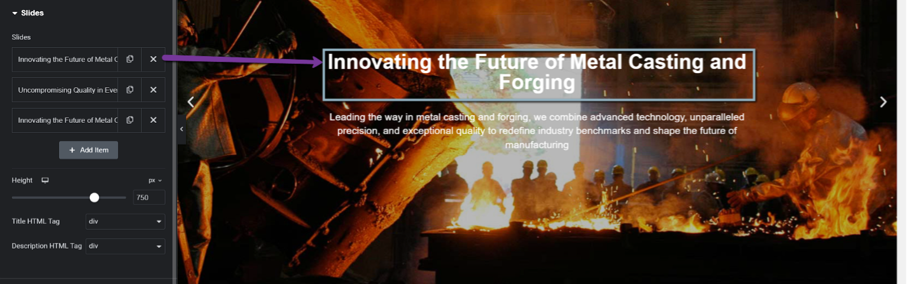

1.	Click on the text you want to edit.

2.	Modify the content in the Text Editor panel on the left.

3.	Press the Publish button to save changes.

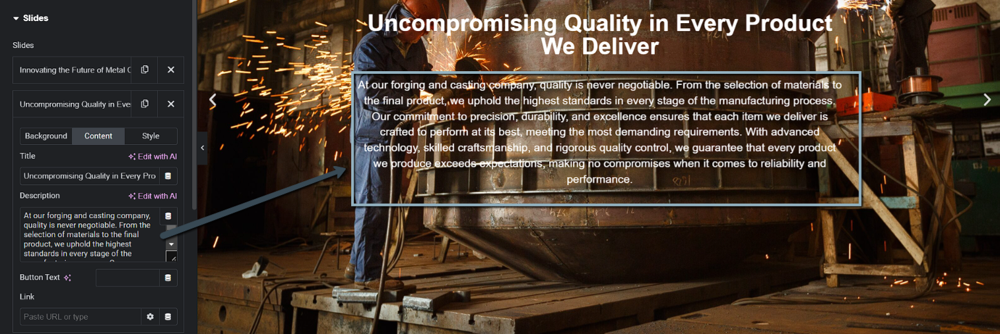

1.	Click on the text you want to edit.

2.	Modify the content in the Text Editor panel on the left.

3.	Press the Publish button to save changes.

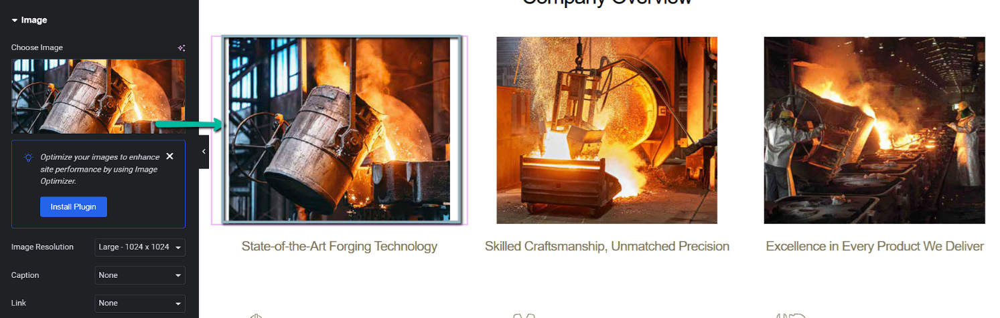

Replace Images: Click on the image, upload a new one from the left panel, and save.

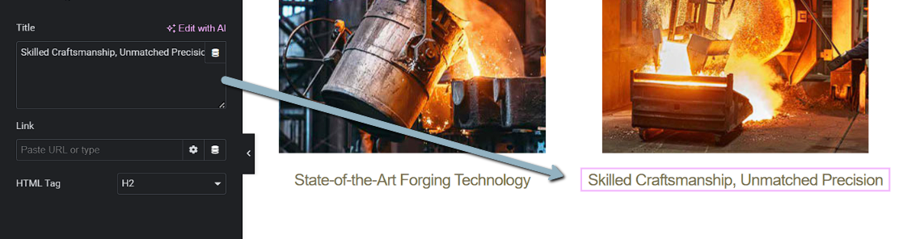

Modify the content in the Text Editor panel on the left.

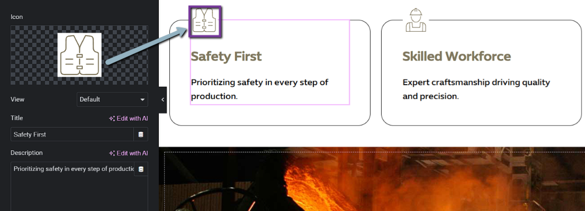

Replace Icon: Click on the icon, upload a new one from the left panel, and save.

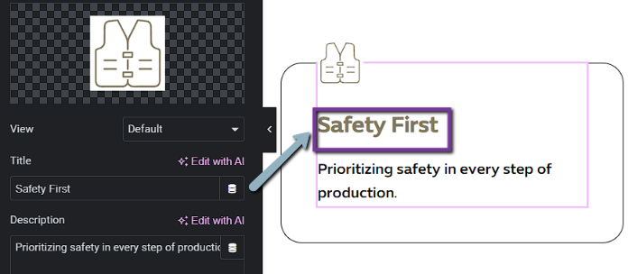

1.	Click on the title you want to edit.

2.	Modify the content in the Text Editor panel on the left.

3.	Press the Publish button to save changes.

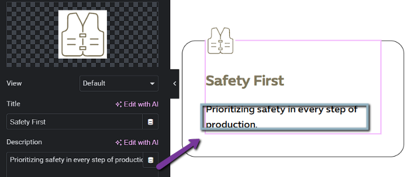

1.	Click on the description you want to edit.

2.	Modify the content in the Text Editor panel on the left.

3.	Press the Publish button to save changes.

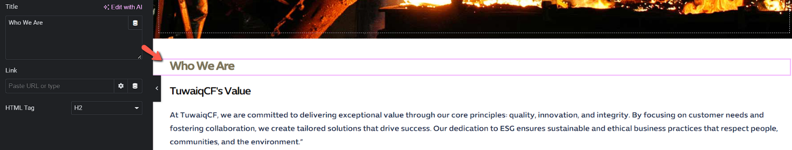

1.	Click on the title you want to edit.

2.	Modify the content in the Text Editor panel on the left.

3.	Press the Publish button to save changes.

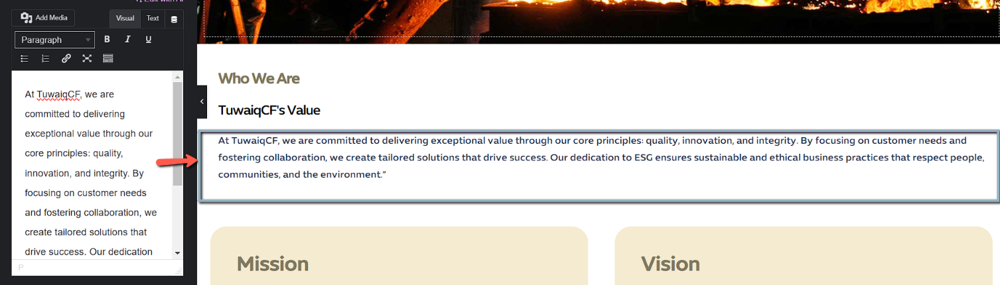

1.	Click on the Paragraph you want to edit.

2.	Modify the content in the Text Editor panel on the left.

3.	Press the Publish button to save changes.

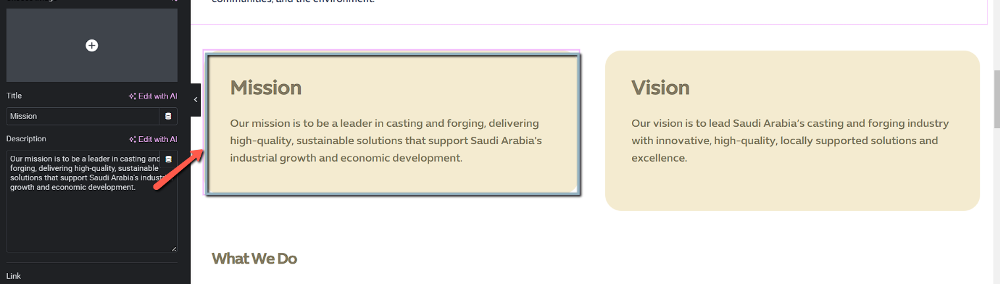

1.	Click on the   box you want to edit.

2.	Modify the content in the Text Editor panel on the left.

3.	Press the Publish button to save changes.

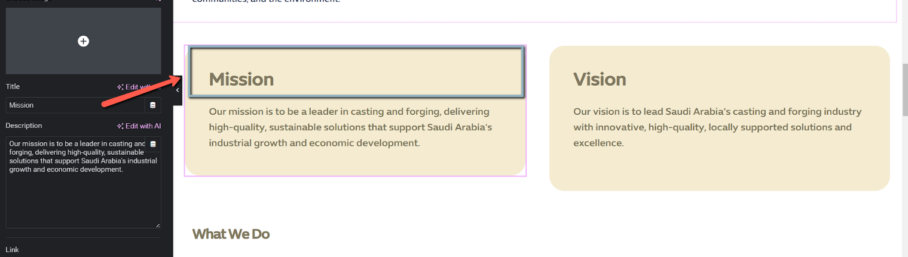

1.	Click on the   title you want to edit.

2.	Modify the content in the Text Editor panel on the left.

3.	Press the Publish button to save changes.

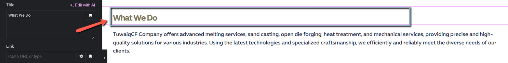

1.	Click on the   title you want to edit.

2.	Modify the content in the Text Editor panel on the left.

3.	Press the Publish button to save changes.

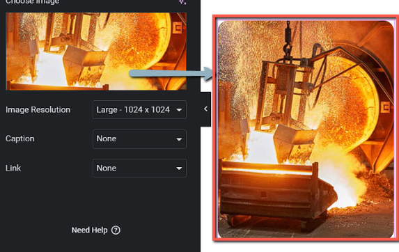

1.	Click on the   image you want to edit.

2.	Modify the content in the Text Editor panel on the left.

3.	Press the Publish button to save changes.

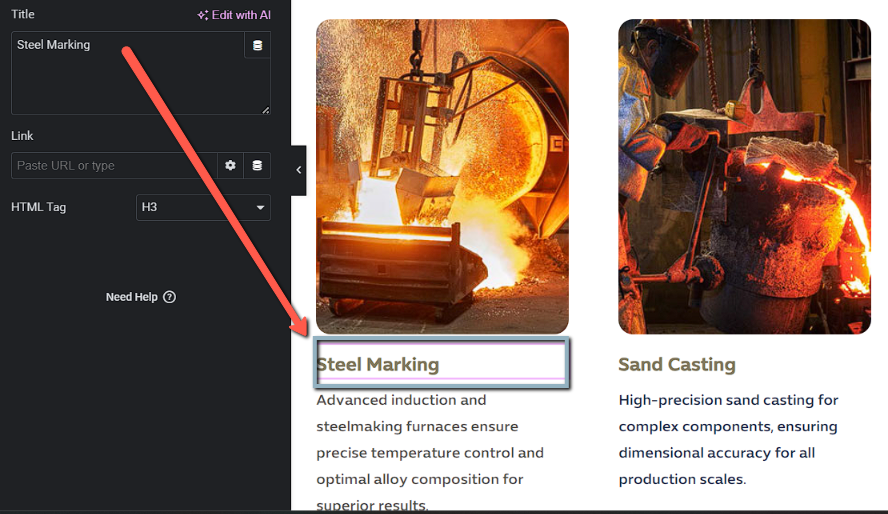

1.	Click on the   title you want to edit. 

2.	Modify the content in the Text Editor panel on the left.

3.	Press the Publish button to save changes.

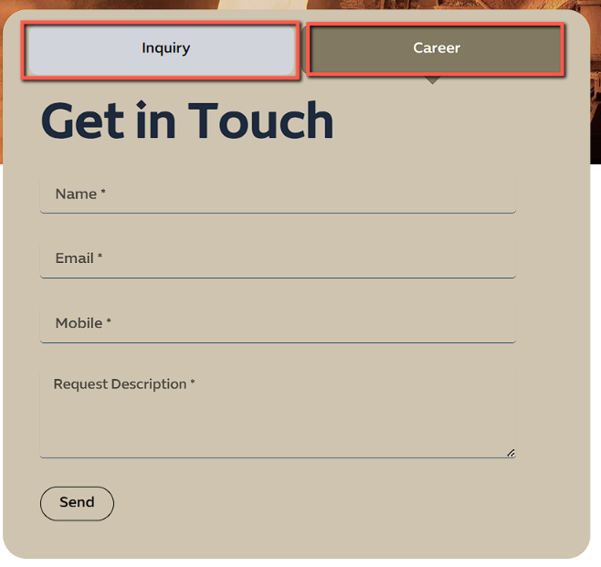

This form has two tabs: Inquiry and Career, allowing users to switch between them based on their needs. Both forms include fields for Name, Email, Mobile, and Request Description,
where users can provide their details and specify their request. The Send button at the bottom submits the form once the user fills in the required information.

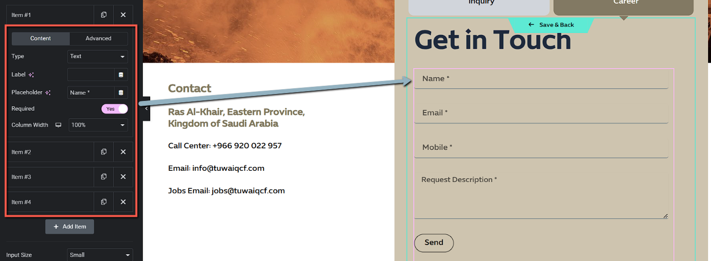

Select the Form Field to Edit:

•	Click on any form field (e.g., Name, Email, Mobile) to access the "Content" tab on the left panel.

Update the Field Content:

•	Edit the Label (field name), Placeholder (input text), or toggle Required to Yes/No.

•	Save changes by clicking the "Save & Back" button at the top.

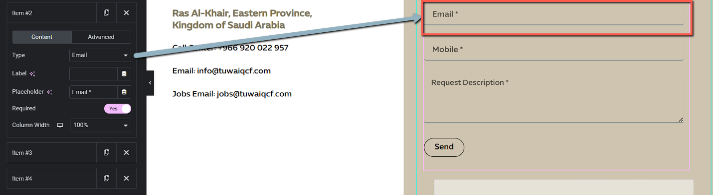

•	Click on any form field (e.g., Name, Email, Mobile) to access the "Content" tab on the left panel.
Update the Field Content:

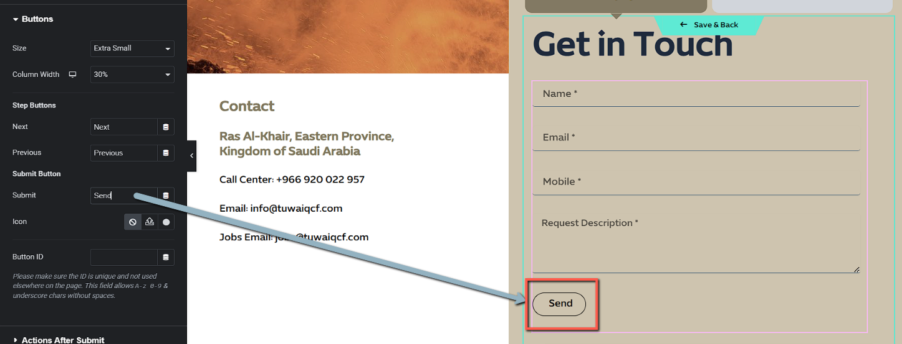

Select the "Send" Button:

Click on the "Send" button in the editor panel to open its settings on the left.

Update Button Text or Icon:

To change the text: Edit the "Submit" field under the "Submit Button" section.
To add/remove an icon: Use the "Icon" section below.

## footer part
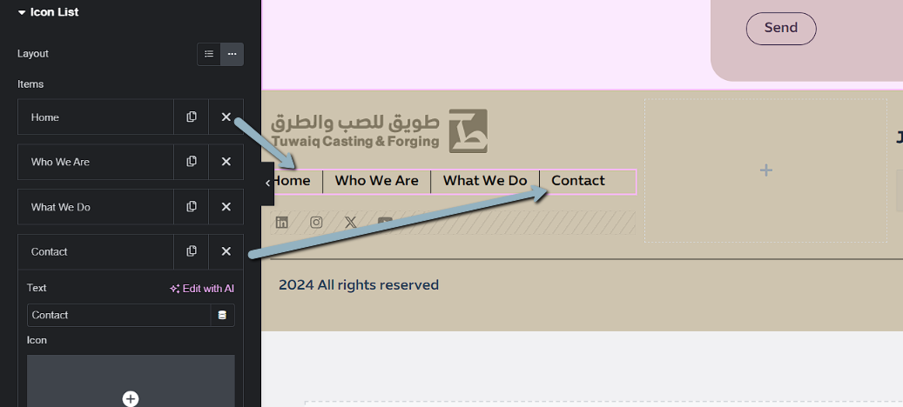

To edit the menu links in Elementor:

1.	Select the Icon List widget → Click on the menu item (e.g., Home, Who We Are) to edit the text, link, or icon.

2.	Update the desired URL or text → Click publish to save changes.

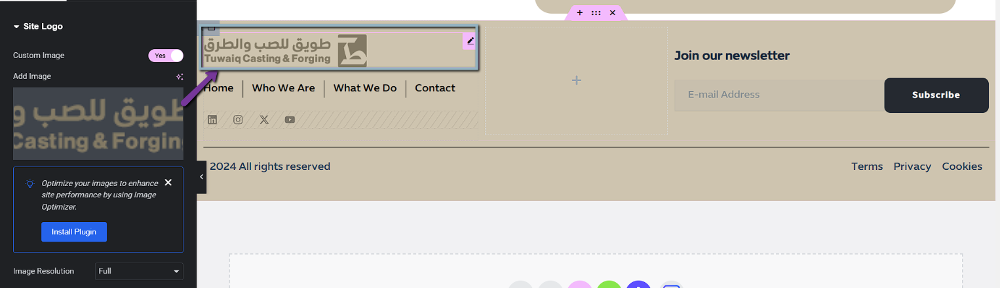

If you need to change the logo

1.	Click on the   logo you want to edit.

2.	Modify the content in the Text Editor panel on the left.

3.	Press the Publish button to save changes.

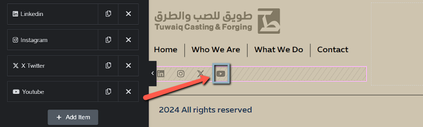

To edit social media links in Elementor:

1.	Select the Social Icons widget → Click on the respective icon (e.g., Twitter, Instagram) to edit the link, title, or icon.

2.	Update the URL for the social media platform → Click Update to save changes.
Ensure all links (social icons, website navigation) are functional.

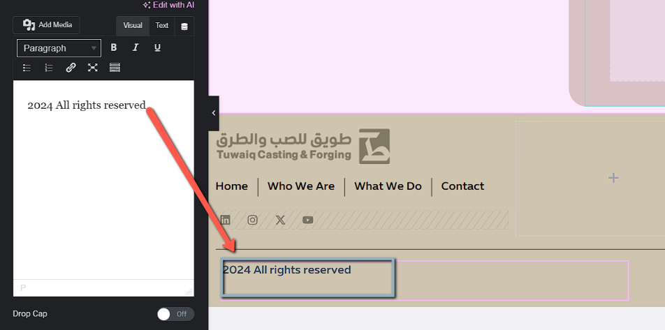

Locate the footer section → Select the text widget containing “2024 All rights reserved".
 Update the text, style, or alignment as needed → Click publish to save changes.

